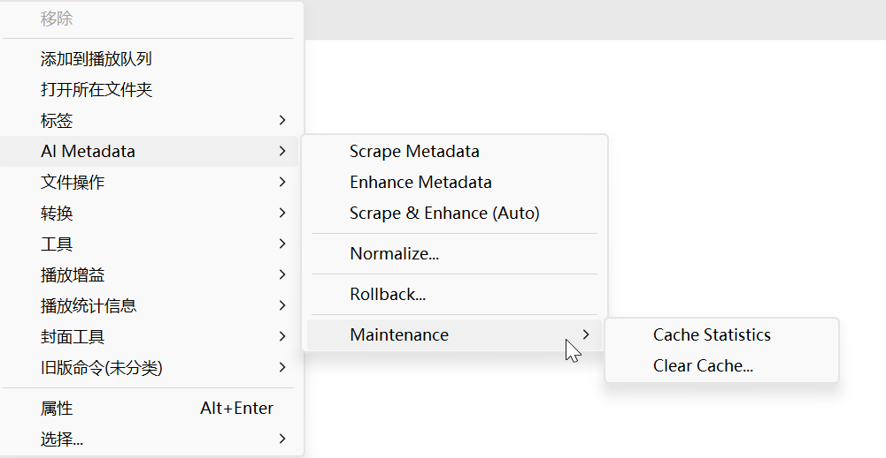
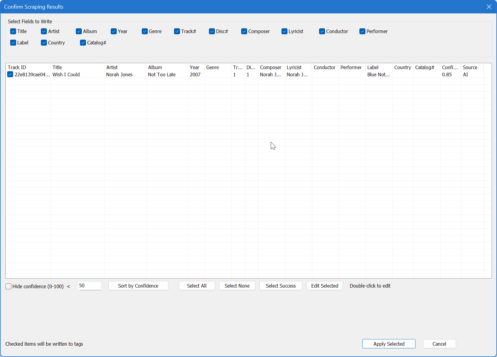
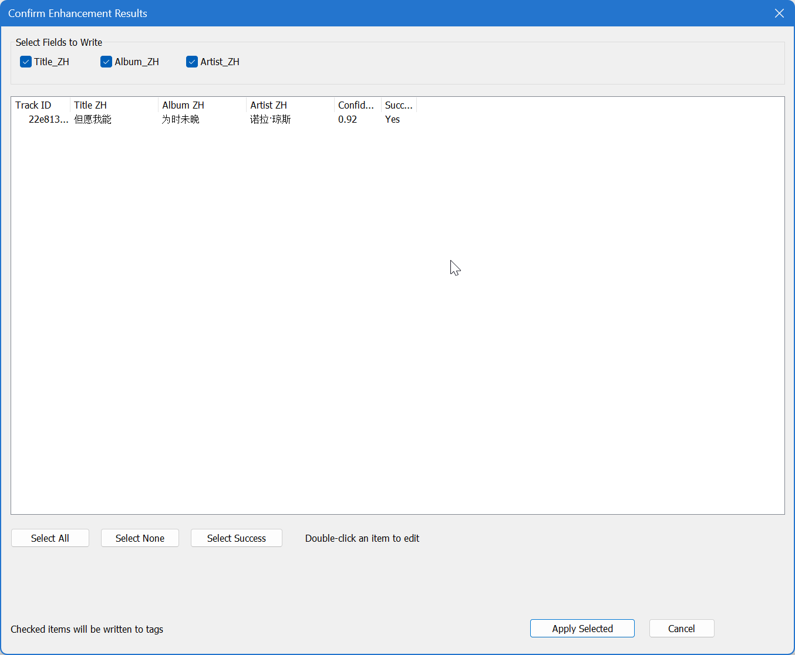

# foo_metadata_enhancer

[](LICENSE)
[](https://www.foobar2000.org/)

A foobar2000 plugin that uses AI to automatically analyze, scrape, and enhance music metadata.

## Features

The plugin is organized around three non-overlapping functions (V8.2 boundary):

- **Scrape** - Fetch data the local file doesn't have, from external sources (facts acquisition)
  - Sources: MusicBrainz (authoritative) → Discogs (supplemental) → AI (fallback)
  - Outputs: title / artist / album / year / genre / composer / ... / musicbrainz_id
  - V8.2: genre is now sourced from MusicBrainz recording details (previously an AI classification task in Enhance)
- **Enhancer** - Derive new value from existing metadata (no new facts fetched)
  - Currently: Chinese translation of title / album / artist
  - V8.2: edition identification removed (AI inference was unreliable); genre no longer produced here
- **Normalize** - Map existing tags to standard tags (consistency)
  - Currently: artist name normalization (alias → canonical)
  - Future: genre mapping, etc.

Additional capabilities:

- **One-Click Processing** - Run Scrape + Enhance in a single step with auto-chaining
- **Smart Caching** - SQLite-based cache to reduce redundant API calls
- **Multi-Operation Rollback** - Independent snapshots per operation type (Scrape / Translate / Normalize); rollback only the selected operation's affected fields
- **Alias Deduplication** - Double deduplication (after user edit + before apply) to prevent duplicate aliases
- **Multiple AI Providers** - Supports OpenRouter, Zhipu AI, Google Gemini, DeepSeek, and Ollama (local)
- **Configurable Translation Style** - Three translation strategies: official / literal / semantic
- **Manual Confirmation for Uncertain Results** - When web search is unavailable (e.g., Zhipu Chat), uncertain results are saved and the user is prompted to confirm






## Requirements

- Register and get API KEY from AI (ZHIPU AI is recommended,this is a free ai service for some models now.Ref to https://bigmodel.cn/console/overview).
- foobar2000 2.0 or later
- Windows 10/11
- Python 3.11+ (required)
- **External Tags** (recommended for CUE sheet support) - Download from [foobar2000 components](https://www.foobar2000.org/components)
  - Configure under `Advanced` → `Tagging` → `External Tags`:
    - ◉ Use only SQLite (fastest)
    - ☑ Open properties dialog after external tag creation
    - ☑ Enable art support in external tags
    - ☑ Take over all tagging (Optional, but recommended)

## Installation

1. Download the latest release from [Releases](https://github.com/yourusername/foo_metadata_enhancer/releases)
2. Extract the archive
3. Copy `foo_metadata_enhancer.dll` and `foo_metadata_enhancer` folder to your foobar2000 `components` folder
4. Restart foobar2000

## Quick Start

1. Select one or more tracks in foobar2000
2. Right-click → **AI Metadata** → **Scrape & Enhance (Auto)** for one-step processing
   - Or run **Scrape Metadata** and **Enhance Metadata** separately for more control
3. Review the results and select fields to write
4. Click **Apply Selected**


## Supported Tags

### Scrape Output

| Tag | Description |
|-----|-------------|
| TITLE | Track title |
| ARTIST | Artist name |
| ALBUM | Album name |
| YEAR | Release year |
| TRACKNUMBER | Track number |
| DISCNUMBER | Disc number |
| COMPOSER | Composer |
| LYRICIST | Lyricist |
| LABEL | Record label |
| GENRE | Genre (from MusicBrainz recording details, V8.2) |

### Enhance Output

| Tag | Description |
|-----|-------------|
| TITLE_ZH | Chinese translation of title |
| ALBUM_ZH | Chinese translation of album |
| ARTIST_ZH | Chinese translation of artist |

> Note: EDITION tag is no longer produced (V8.2 removed AI edition identification as unreliable).
> GENRE moved from Enhance to Scrape (V8.2) — it is now a fact fetched from MusicBrainz, not an AI inference.

### Normalize Output

| Tag | Description |
|-----|-------------|
| ARTIST | Normalized artist name (alias → canonical) |
| ALBUM ARTIST | Normalized album artist |
| (future) | Genre mapping, etc. |


## Building from Source

### Prerequisites

- Visual Studio 2022 with C++ workload
- CMake 3.20+
- foobar2000 SDK 2024

### Build Steps

#### 1. Clone and Configure

```bash
git clone https://github.com/yourusername/foo_metadata_enhancer.git
cd foo_metadata_enhancer
```

Copy the config template and fill in your API keys:

```bash
copy worker\config.yaml.template worker\config.yaml
# Edit worker\config.yaml with your API keys
```

#### 2. Build

```bash
# Configure (with auto-deploy to local foobar2000)
Remove-Item -Recurse -Force out/build; cmake -B out/build -G "Visual Studio 18 2026" -A x64 -DFOOBAR_DEV_DIR="D:/Programs/foobar2000_asion"

# Or configure without auto-deploy (for packaging only)
Remove-Item -Recurse -Force out/build; cmake -B out/build -G "Visual Studio 18 2026" -A x64

# Build
cmake --build out/build --config Release -- /m
```

#### 3. Package

```powershell
# Use version from .rc file
.\tools\pack.ps1

# Specify version manually
.\tools\pack.ps1 -Version 1.0.0

# Build and package in one step
.\tools\pack.ps1 -BuildFirst
```

The zip file will be generated in `zips/` folder:

```
zips/foo_metadata_enhancer-1.0.0.zip
├── foo_metadata_enhancer.dll
└── foo_metadata_enhancer/
    ├── cache/        (empty)
    ├── logs/         (empty)
    └── worker/       (Python scripts + config.yaml from template)
```

#### 4. Install

Extract the zip to foobar2000's `components/` directory:

```
foobar2000/
└── components/
    ├── foo_metadata_enhancer.dll
    └── foo_metadata_enhancer/
        ├── cache/
        ├── logs/
        └── worker/
            ├── config.yaml   ← Edit this with your API keys
            └── ...
```


## Troubleshooting

### Plugin not appearing in menu

1. Ensure `foo_metadata_enhancer.dll` is in the `components` folder
2. Check Help → About to verify the plugin is loaded
3. Restart foobar2000

### AI processing fails

1. Verify your API key is correct
2. Check network connectivity
3. Review logs in `%APPDATA%\foobar2000-v2\foo_metadata_enhancer\logs\`

### Worker process crashes

1. Ensure Python 3.11+ is installed and in PATH
2. Check Python packages are installed
3. Try restarting foobar2000

### Tags not writing to CUE files

Install and configure the External Tags plugin as described in Requirements.

### Rollback dialog fails to open (error code: 1814)

`ERROR_RESOURCE_NAME_NOT_FOUND (1814)` means the rollback dialog resource is missing from the DLL. Causes and fixes:

1. **Stale `.res` file** — delete `out/build/foo_metadata_enhancer.dir/<Config>/foo_metadata_enhancer.res` and rebuild.
2. **UTF-8 Chinese comment in `plugin/resource.h` breaking the RC compiler** — the RC compiler parses `.h` files as ANSI/GBK by default. A line comment ending with a multi-byte UTF-8 character (e.g. `// 回滚类型选择对话框`, whose last byte `0x86` is a GBK lead byte) can swallow the following newline, causing the next `#define IDD_...` to be silently dropped. Keep comments in `resource.h` ASCII-only, or save the file as UTF-16 LE with BOM.
3. **Outdated DLL deployed** — after rebuilding, copy `out/build/Release/foo_metadata_enhancer.dll` to foobar2000's `components/` directory (close foobar2000 first if the file is locked).

Verify the resource is present as a numeric ID (not a string name) by enumerating the DLL's resources; `IDD_ROLLBACK_TYPE_SELECT` must appear as `type=5 name=num:3073`.

### Enhancer confirmation dialog shows blank cells for Chinese tracks

When the original metadata is already in Chinese, the AI correctly returns empty `*_zh` fields (no translation needed). The confirmation dialog now falls back to displaying the original value in the Title ZH / Album ZH / Artist ZH columns (same behavior as the Scrape confirmation dialog), instead of showing empty cells. The `Confidence` column displays `N/A (Chinese)` and `Success` displays `Skipped`; these rows are unchecked by default and will not write any tag unless you manually check them.

## License

MIT License - see [LICENSE](LICENSE) for details.

## Acknowledgments

- [foobar2000 SDK](https://www.foobar2000.org/SDK)
- [MusicBrainz API](https://musicbrainz.org/doc/Development/XML_Web_Service/Version_2)
- [Discogs API](https://www.discogs.com/developers)
- [nlohmann/json](https://github.com/nlohmann/json)
